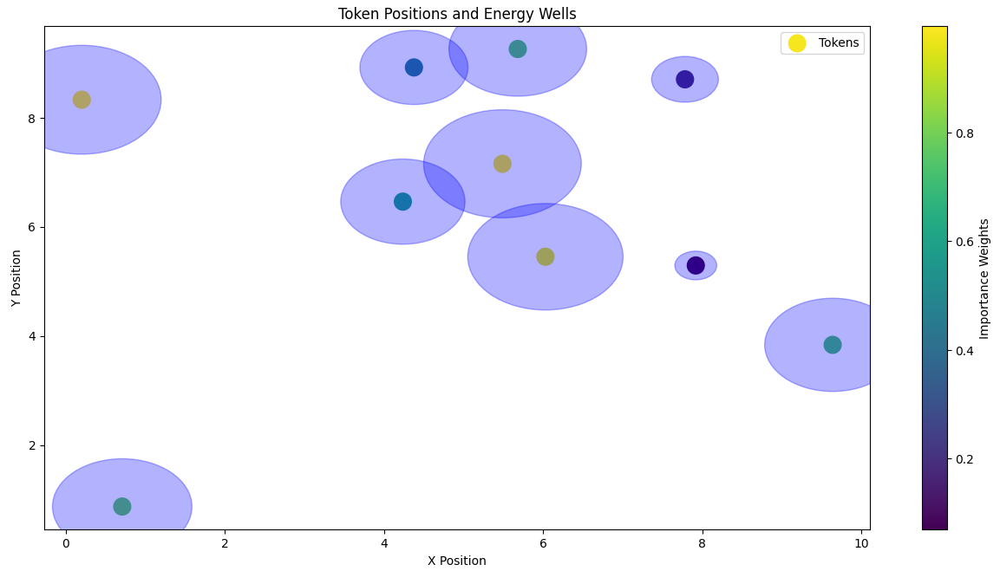
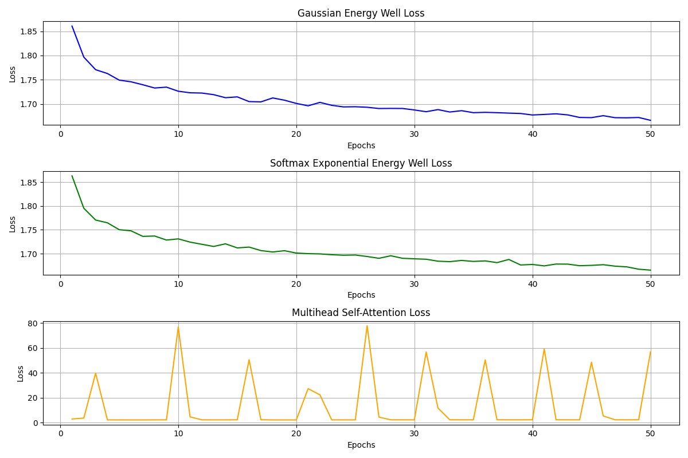
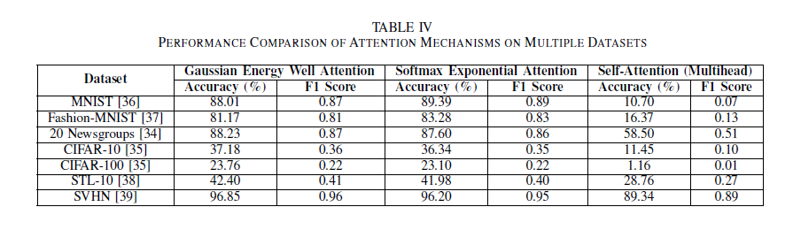

# Energy-Well Based Distance-Aware Attention Mechanism for Tunable Focus: An Alternative to Self-Attention

Welcome to the repository for **Energy-Well Based Distance-Aware Attention Mechanism for Tunable Focus**, a novel attention framework inspired by physical energy fields. This repository contains the code and implementation details for our energy-well-based approach, which enhances traditional transformer models by integrating tunable, distance-aware attention mechanisms. The methods here are designed to capture both intra-cluster and inter-cluster dependencies, improving interpretability and efficiency across diverse applications.

## 📄 Abstract

Conventional attention mechanisms, especially in Transformer architectures, often focus on intra-cluster relationships, limiting their capacity to model essential inter-cluster dependencies. Our study introduces an **energy-well-based attention mechanism** that uses several mathematical configurations (e.g., Gaussian, Lorentzian, softmax exponential) to dynamically adjust attentional focus based on spatial or conceptual “distance” between tokens. The energy-well approach not only achieves superior interpretability but also enhances model accuracy and computational efficiency.

## 📐 Mathematical Framework

Our attention mechanism is inspired by the concept of **potential energy wells** in physics, where each token exerts an influence that decays with distance, modeled by various energy well configurations. Here’s a detailed breakdown of each configuration:

### 1. Gaussian Energy Well
The **Gaussian Energy Well** introduces a smooth, localized attention decay. Each token \( i \) exerts an influence that follows a Gaussian distribution, governed by a decay parameter \( \alpha \), which controls the spread of attention.

- **Energy Field Function**:
  E(x, x_i, α) = exp( -α || x - x_i ||^2 )
  where:
- `E(x, x_i, α)`: Energy at position `x` due to token `i`.
- `α`: Decay parameter; higher values localize the attention spread, while lower values broaden it.



### 2. Inverse Square Energy Well
The **Inverse Square Well** configuration allows broader influence over distance, maintaining attention across clusters while gradually decaying based on the inverse square of the distance.

- **Energy Field Function**:
  E(x, x_i) = w_i / (|| x - x_i ||^2 + ε)
  where:
- `w_i`: Importance weight of token `i`.
- `ε`: Small constant to prevent division by zero.

### 3. Softmax Exponential Energy Well
This configuration introduces **softmax normalization** over distances, distributing attention based on a balance between spatial proximity and token significance.

- **Energy Field Function**:
  E(x, x_i) = exp(-α || x - x_i ||) / ∑_j exp(-α || x - x_j ||)
  The softmax normalization ensures the adaptive distribution of attention across clusters based on distance.

### 4. Lorentzian Energy Well
The **Lorentzian Well** applies a broader, slower-decaying influence, capturing long-range dependencies with a gradual decay profile, suitable for cases with inter-cluster dependencies.

- **Energy Field Function**:
  E(x, x_i) = w_i / (1 + α || x - x_i ||^2)


## 🔢 Attention Score Calculation

The **attention score** between tokens `i` and `j` is computed by combining the energy gradient with the energy field value. The resulting attention matrix controls the directional influence of tokens.

- **Attention Score Calculation**:
attention_matrix(i, j) = exp( -|| energy_gradient || * E_field(i, j) )
where:
- **Energy Gradient**: Calculated as `-(x_j - x_i)`, directing attention based on token distances.

## 📊 Inter- and Intra-Cluster Dynamics

Each configuration enhances either intra-cluster concentration or inter-cluster attention, depending on its decay characteristics. Key metrics for assessing these dynamics include:

- **Cluster Concentration**: Sum of attention scores within high- and low-importance clusters.
- **Inter-Cluster Attention**: Sum of attention scores between clusters, which is particularly relevant for configurations like **Lorentzian** and **Softmax Exponential**, that promote cross-cluster connectivity.

## 📈 Experimental Results

Our experiments across text and image datasets validate the benefits of this approach:

- **Improved Interpretability**: Enhanced attention focus within clusters, providing clearer activation patterns.
- **Higher Accuracy**: Demonstrated improvements in classification tasks compared to conventional self-attention.
- **Reduced Computational Cost**: Efficiency in long-sequence tasks, with limited interactions based on distance.




## 📄 Citation

[Preprint Paper Link](https://www.techrxiv.org/doi/full/10.36227/techrxiv.173145064.43169558/v1)

If you find this repository useful in your research, please cite my work as follows:

```bibtex
@article{sarker2024energy,
  title={Energy-Well Based Distance-Aware Attention Mechanism for Tunable Focus: An Alternative to Self-Attention},
  author={Sarker, Soumick},
  journal={Authorea Preprints},
  year={2024},
  publisher={Authorea}
}

